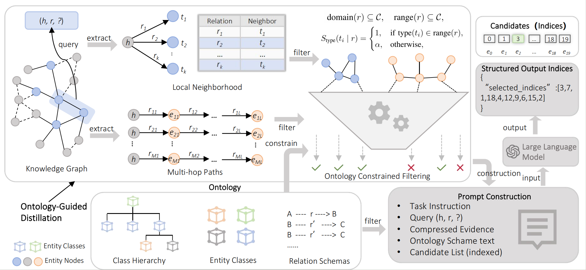

# OD-KGC: Ontology-Guided Evidence Reasoning for LLM-based Knowledge Graph Completion

OD-KGC is an ontology-guided evidence reasoning framework for knowledge graph completion with large language models (LLMs).
The framework extracts structural evidence from knowledge graphs, calibrates evidence using ontology constraints, compresses key evidence under a token budget, and performs LLM-based candidate reasoning for final prediction.

---

## Highlights

* **RotatE-guided structural evidence extraction**
  OD-KGC retrieves one-hop and multi-hop structural evidence around the query entity using RotatE-based graph reasoning.

* **Query-aware evidence filtering**
  Instead of removing all evidence containing the correct tail entity, OD-KGC only filters direct query leakage triples while preserving useful indirect evidence related to the correct answer.

* **Ontology-guided evidence calibration**
  Entity classes and relation range constraints are incorporated into evidence scoring to improve semantic consistency between structural evidence and query relations.

* **Compact evidence compression**
  OD-KGC compresses evidence into a small set of high-quality key evidence under a token budget while removing redundant relation patterns and duplicated terminal entities.

* **LLM-based evidence reasoning**
  The compressed evidence is used together with candidate entities for final LLM-based reasoning and ranking.

---

Then it will be displayed automatically:



---

## Usage

### 1. Clone the repository

```bash
git clone https://github.com/Wenbin4AI/OD-KGC.git
cd OD-KGC
```

---

### 2. Create environment

```bash
conda create -n odkgc python=3.10 -y
conda activate odkgc
```

Install dependencies:

```bash
pip install -r requirements.txt
```


---

### 3. Configure LLM API

Edit `config.py`:

```python
"openai_api_key": "YOUR_API_KEY",
"openai_base_url": "YOUR LLM BASE URL",
```

Most hyperparameters already have default values.

---

### 4. Run the full pipeline

```bash
python run.py
```

---

### 5. Run modules separately

#### Structural evidence extraction

```bash
python model/extractor.py \
  --data_path data/FB15k-237
```

#### Ontology-aware filtering

```bash
python model/filter.py \
  --data_path data/FB15k-237 \
  --filter_mode no_llm
```

Use LLM-based ontology reasoning:

```bash
python model/filter.py \
  --data_path data/FB15k-237 \
  --filter_mode precise
```

#### Evidence compression

```bash
python model/compressor.py \
  --data_path data/FB15k-237
```

#### LLM evaluation

```bash
python src/evaluator.py \
  --data_path data/FB15k-237 \
  --parallel_workers 4
```

---

## Citation

```bibtex
@article{wang2026odkgc,
  title={From Graph Structure to Model-Agnostic Evidence: Ontology-Guided LLM Reasoning for Knowledge Graph Completion},
  author={Wang, Wenbin and others},
  journal={arXiv preprint},
  year={2026}
}
```
